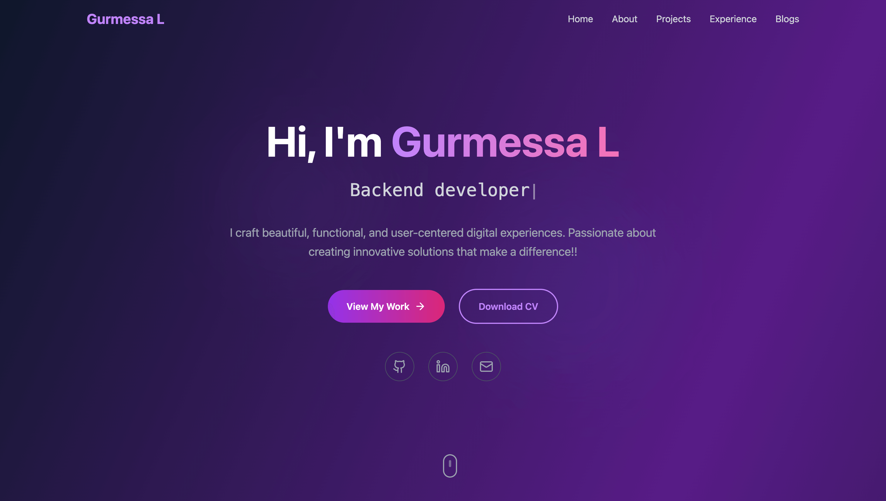
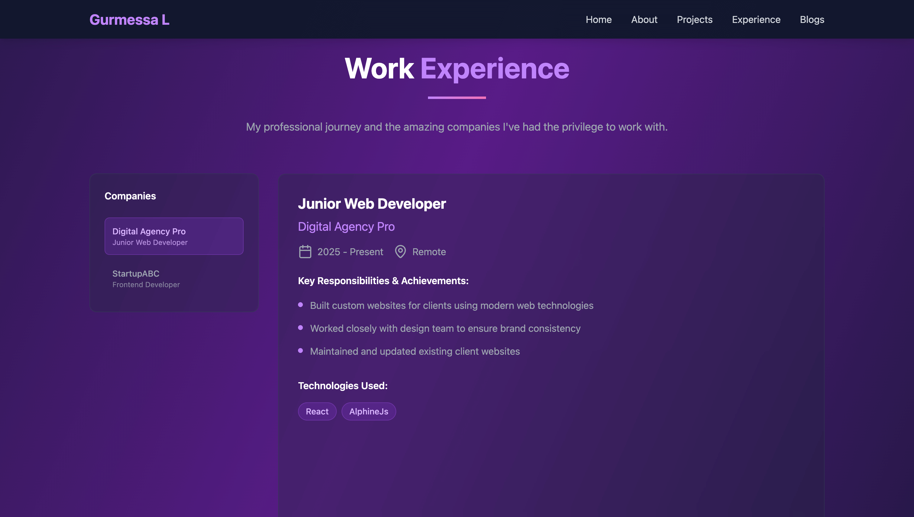
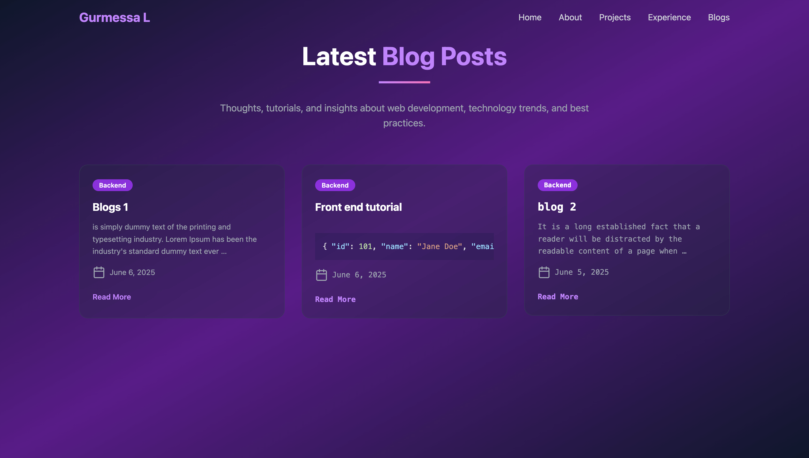
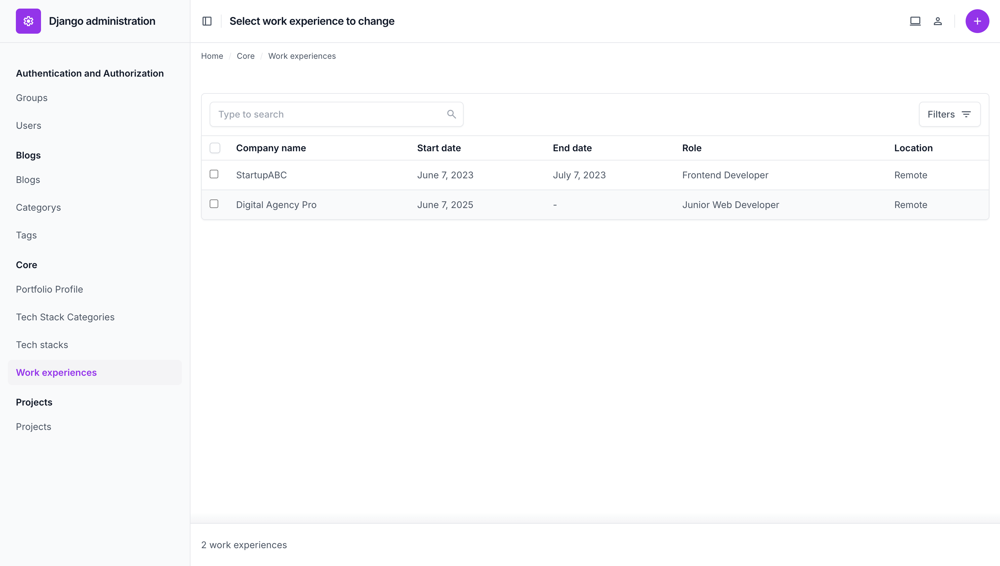

# Portfolio website

Portfolio website built using Django, tailwind and Alpine.js
---

## Features

- ✅ **Blog system** with CKEditor (rich text editor with code formatting support)  
- 🎨 **Custom Django admin** interface using `django-unfold`  
- 💼 Manage **Projects**, **Work Experiences**, and **About Me** sections  
- 🖼️ **Image thumbnails** generated using `sorl-thumbnail`  
- 🧪 **Tests** for views and models included  
- 🏭 **Factory Boy** used to generate test data  
- 🏷️ **Meta tags** added for SEO on selected pages  
- 🔁 **Singleton model** (`PortfolioProfile`) to manage site-wide portfolio info  
- ⚙️ **Environment-specific settings** for production and local development  
- 🔄 **Context processor** to pass `PortfolioProfile` instance to all templates automatically  
- 🔍 **Filter views** with `django-filter` for flexible querying  
- ⚡ **Alpine.js** used for frontend interactivity including carousel, tabs, and navigation drawer  

---

## Dependencies

This project uses these libraries:

* **django-filter** – makes filtering querysets easier
* **django-solo** – handles single-instance models
* **django-ckeditor** – rich text editor in the admin
* **django-unfold** – improves the Django admin interface
* **django-environ** – loads .env settings and converts them to Python types
* **factory\_boy** – helps create test data
* **sorl-thumbnail** – handles image thumbnails
* **black** – auto-formats Python code
---

## Installation

Follow these steps to set up the project locally:

1. **Clone the repository**

   ```bash
   git clone https://github.com/gurmessa/my-portfolio.git
   cd your-repo
   ```

2. **Create and activate a virtual environment**

   ```bash
   python -m venv venv
   source venv/bin/activate   # On Windows use `venv\Scripts\activate`
   ```

3. **Install dependencies**

   ```bash
   pip install -r requirements.txt
   ```

4. **Set up environment variables**

   Copy the example file and adjust values as needed:

   ```bash
   cp env.example .env
   ```

   Then edit `.env` to match your local settings:

   ```dotenv
   # Django settings
   DJANGO_SETTINGS_MODULE=myportfolio.settings.local
   SECRET_KEY=your-secret-key-here
   DEBUG=True
   ```

5. **Apply migrations**

   ```bash
   python manage.py migrate
   ```

6. **Run the server**

   ```bash
   python manage.py runserver
   ```
7. **Update your profile**

   After setting up the project, visit the Django admin panel and update the `PortfolioProfile` model with your own details:

   - Full name  
   - Job title  
   - Headline  
   - About section  
   - Resume file  
   - GitHub & LinkedIn links  
   - Email and phone number  

   This information will be displayed on the portfolio website.

---

## Screenshots

<table>
  <tr>
    <td></td>
    <td></td>
  </tr>
  <tr>
    <td></td>
    <td></td>
  </tr>
</table>
